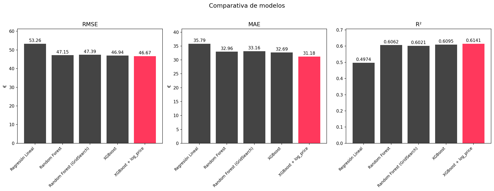
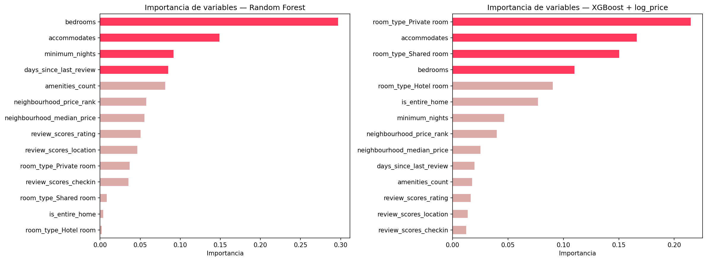
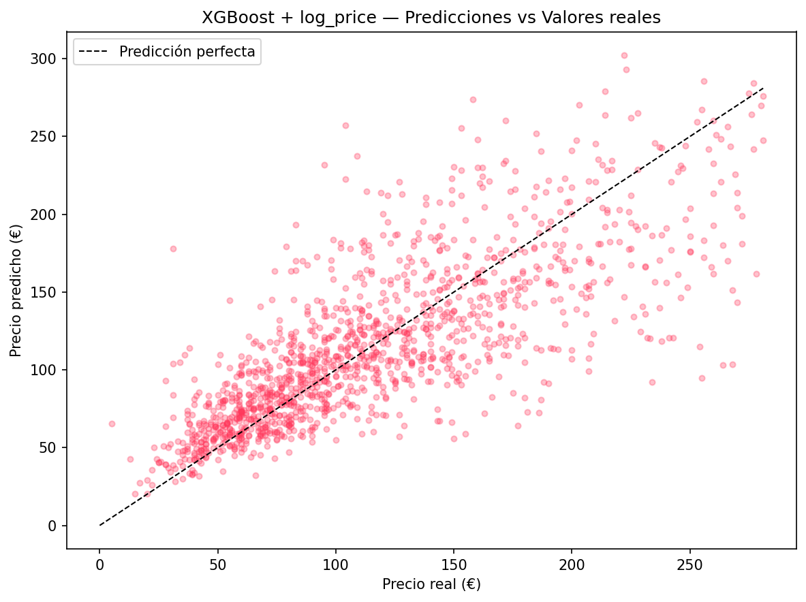

# Airbnb Berlin — Predicción de precios

Pipeline completo de machine learning para predecir el precio de alojamientos en Airbnb Berlín, desde la limpieza de datos hasta un dashboard interactivo en Power BI.

## Resultados

| Modelo | RMSE | MAE | R² |
|---|---|---|---|
| **XGBoost + log_price** | **46.67€** | **31.18€** | **0.61** |
| XGBoost | 46.94€ | 32.69€ | 0.61 |
| Random Forest | 47.15€ | 32.96€ | 0.61 |
| Random Forest (GridSearch) | 47.39€ | 33.16€ | 0.60 |
| Regresión Lineal | 53.26€ | 35.79€ | 0.50 |

**Mejor modelo:** XGBoost con transformación logarítmica del target — RMSE de 46.67€ y R² de 0.61. El 81% de las predicciones tienen un error inferior a 50€.

## Visualizaciones







## Estructura del proyecto
```
├── Airbnb_Berlin_Eda_limpieza.ipynb
├── Airbnb_Berlin_Eda_visualizaciones.ipynb
├── Airbnb_Berlin_feature_engineering.ipynb
├── Airbnb_Berlin_modelado.ipynb
├── Dashboard.pbix
└── README.md
```

## Pipeline

1. **EDA y limpieza** — selección de 16 variables relevantes sobre 14.274 registros, tratamiento de nulos y transformación de tipos
2. **Visualización** — distribución de precios, análisis de outliers, correlaciones y análisis por barrios y tipo de alojamiento
3. **Feature engineering** — creación de variables derivadas: `log_price`, `price_per_person`, `neighbourhood_median_price`, `neighbourhood_price_rank`, `amenities_count`, `days_since_last_review`, `is_entire_home`
4. **Modelado** — comparativa de 5 modelos, optimización de hiperparámetros con GridSearchCV y selección del mejor modelo

## Variables más importantes

Según el modelo XGBoost final, las variables con mayor poder predictivo sobre el precio son el tipo de habitación, la capacidad del alojamiento y el número de habitaciones. Las variables de barrio tienen un peso moderado pero consistente.

## Tecnologías

- Python, Pandas, NumPy, Scikit-learn, XGBoost, Matplotlib, Seaborn
- Power BI Desktop
- Dataset: [Inside Airbnb — Berlin](http://insideairbnb.com/berlin)

## Nota metodológica

El modelo predice precios basándose en características estructurales del alojamiento. No incluye datos de demanda en tiempo real ni estacionalidad, por lo que se trata de predicción de precio estructural y no de pricing dinámico. El R² de 0.61 es coherente con esta limitación.
